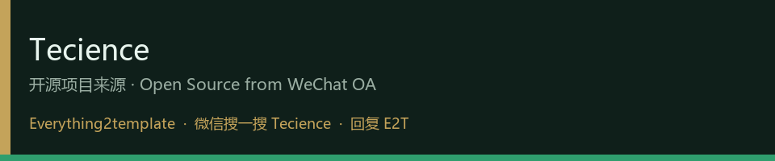
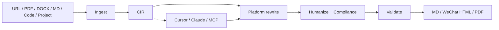

# Everything2template

<p align="center">
  <strong>万物成稿 · 一源五发</strong><br/>
  <em>Any source → platform-native drafts for WeChat · Xiaohongshu · Zhihu · Weibo · Douyin</em>
</p>

<p align="center">
  
</p>

<p align="center">
  <a href="LICENSE"></a>
  <a href="pyproject.toml"></a>
  <a href="docs/strongest_score.json"></a>
  <a href="docs/competitive.md"></a>
  <a href="#tecience-公众号--来源与关注"></a>
</p>

<p align="center">
  <a href="#quickstart">Quickstart</a> ·
  <a href="#architecture">Architecture</a> ·
  <a href="#why-not-another-prompt-pack">Why us</a> ·
  <a href="docs/competitive.md">Competitive</a> ·
  <a href="SUPPORT.md">Support</a>
</p>

---

**Everything2template (e2t)** is a local-first, agent-native **content adapter**: ingest messy real-world materials, lock facts into a **CIR**, then **rebuild** structure for each platform — not “same essay, five skins”.

Built for creators who need **publishable drafts** (hooks, length, CTA, compliance), not chat-window paste.

| Capability | What you get |
|---|---|
| **Everything ingest** | URL · PDF · DOCX · Markdown · text · code · project tree |
| **CIR once** | Canonical Intermediate Representation — grounded facts, portable paths |
| **5 platforms** | 微信公众号 · 小红书 · 知乎 · 微博 · 抖音口播 |
| **Quality system** | Rewrite engine · humanize · compliance · validate (anti-filler / anti-truncation) |
| **Delivery** | Markdown · WeChat paste HTML · CJK PDF |
| **Surfaces** | CLI · Cursor skill · MCP lite · local trial web |

> Optional LLM polish (DeepSeek / Ollama) is an accelerator. **Without a key, the rules rewrite engine still ships platform-native drafts.**

---

## Architecture



**Design principle:** extract once → adapt many times. Agents rewrite against CIR + platform templates; the CLI keeps the spine deterministic and measurable.

---

## Why not another prompt pack?

| Category | Typical offer | Gap |
|---|---|---|
| Cloud paste→rewrite SaaS | Fast multi-platform copy | Weak on PDF/code/project; cloud lock-in |
| Prompt / MCP style packs | Many platforms in prompts | Markdown-in only; thin gates; no CIR |
| Matrix publish suites | Hot topics + auto-publish | Heavy; account/cookie risk |
| Single-platform skills | Deep craft for one channel | No multi-source · multi-export spine |

**Our wedge:** ingest breadth × platform rebuild × exportable delivery × **measurable quality** (`scripts/strongest_score.py`).

See the full map in [docs/competitive.md](docs/competitive.md).

---

## Quickstart

```bash
git clone https://github.com/QinHsiu/Everything2template.git
cd Everything2template
pip install -e ".[dev]"

e2t version
e2t run examples/sample_inputs/demo_article.md --no-llm
python scripts/strongest_score.py   # open-source quality gate
```

### Trial web (local)

```bash
e2t web
# → http://127.0.0.1:8767
```

Paste text / URL / upload a file → score drafts per platform.

### Cursor skill

```text
skill/everything2template  →  <workspace>/.cursor/skills/everything2template
```

Slash commands: `/e2t` · `/e2t_wechat` · `/e2t_xhs` · `/e2t_zhihu` · `/e2t_export`  
Install notes: [docs/INSTALL.md](docs/INSTALL.md)

### One-shot CLI

```bash
e2t run examples/sample_inputs/demo_article.md --platforms wechat,xiaohongshu,zhihu --no-llm
e2t ingest https://example.com/post
e2t validate -p wechat content/runs/<id>/wechat/draft.md
e2t export  content/runs/<id>/wechat/draft.md -f all
python -m e2t.mcp_server
```

LLM polish (optional): [docs/deepseek.md](docs/deepseek.md)

---

## Quality bar

We treat “commercializable effect” as an **engineering gate**, not a slogan:

```bash
python scripts/strongest_score.py      # rewrite quality + parity + tests
python scripts/check_no_local_paths.py # no machine-local path leaks
python -m pytest -q
```

Artifacts live under `content/exp/e2t-oss-strongest-v4/` and `docs/strongest_score.json`.

---

## Repository map

```text
src/e2t/                 # ingest · CIR · rewrite · validate · export · web · MCP
skill/everything2template/
scripts/                 # strongest_score · commercial_score · path hygiene
examples/                # demo inputs + polished samples
docs/                    # competitive · GTM · install · trial web
content/publish/         # Tecience-ready launch assets (optional channel)
```

---

## Tecience 公众号 · 来源与关注

本仓库由微信公众号 **Tecience** 开源维护。扫码关注 / 打开仓库：

| 微信扫码关注 Tecience | 本仓库 GitHub | 作者主页 |
|:---:|:---:|:---:|
|  |  |  |

- **关注：** 微信扫一扫上方公众号码，或搜一搜 **Tecience**  
- **关键词：** 回复 `E2T` 获取改写技能相关说明与更新（可选 Pro / 支持不挡开源核心）  

官方码原图：`docs/assets/tecience/qr-wechat-oa.png`

---

## License & support

- **License:** [Apache-2.0](LICENSE) — open core, free to use and fork  
- **Changelog:** [CHANGELOG.md](CHANGELOG.md)  
- **Support:** [SUPPORT.md](SUPPORT.md)  
- **From:** WeChat OA **Tecience**（上表扫码 / 搜一搜）

---

<p align="center">
  <sub>Local-first · Agent-native · Publishable by default · From Tecience</sub>
</p>
